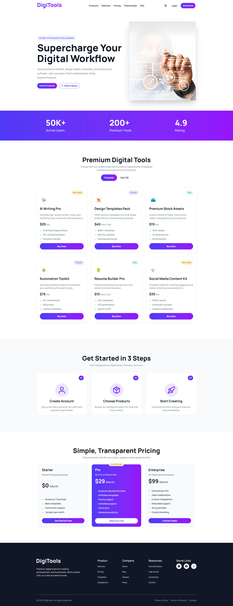

# 🚀 DigiTools

Hi there! DigiTools is a passion project I built to explore the future of the web. It’s a modern, snappy SaaS marketplace where you can browse premium digital tools, compare pricing, and manage a shopping cart—all powered by the latest and greatest in the React ecosystem.

## 📖 Description

I wanted to build a platform that feels as smooth as a native app. DigiTools allows users to explore a curated catalog of software, check out transparent subscription tiers, and handle a full checkout flow. The goal was to combine a clean "SaaS-style" aesthetic with high-performance code.

## 💻 Tech Stack

* **Core:** React 19
* **Build Tool:** Vite
* **Styling:** Tailwind CSS v4
* **State:** React Hooks (`useState`, `use`)
* **UI Feedback:** React Toastify & React Suspense

## ✨ Key Features

1. **Next-Gen Data Orchestration**
   Utilizes React 19’s new `use()` API for declarative data fetching. Integrated with Suspense and custom loading spinners, it ensures a smooth, non-blocking UI while resolving product and pricing data.

2. **Interactive Cart Engine**
   Features a smart shopping cart with Duplicate Prevention (via `find`), Real-time Price Calculation (via `reduce`), and Dynamic UI Feedback where buttons instantly reflect the "Added" state.

3. **Dynamic Pricing Architecture**
   A sophisticated pricing system that uses Conditional Rendering to highlight specific plans (e.g., "Most Popular"). The UI automatically adapts styles, badges, and button themes based on data properties.

## 🌐 Live Website

[View Live Website](https://digitools-page.netlify.app)

## 📸 Screenshot

> Add a screenshot of the project inside the `public` folder and name it `screenshot.png`.

### GitHub: [FahmidaAkterShimu](https://github.com/FahmidaAkterShimu)
